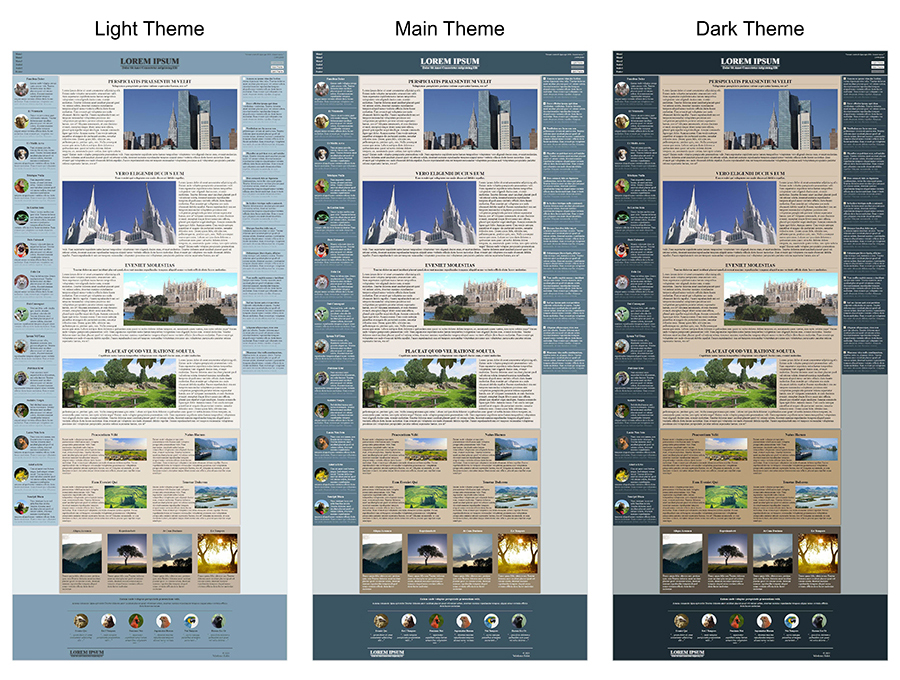
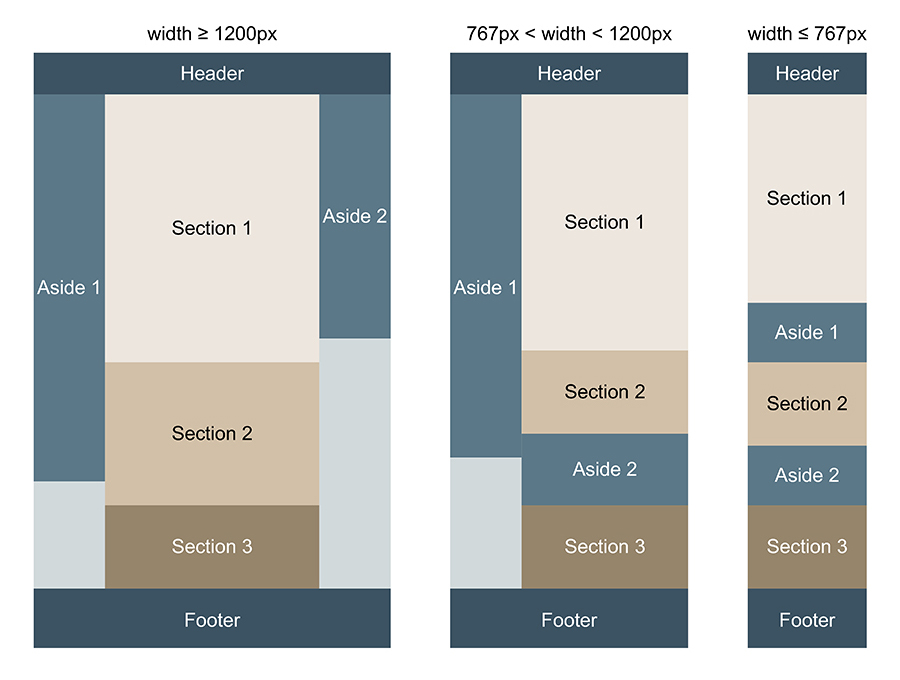

# Web Page 2

This web page has header, 3 main sections, 2 sidebars and footer. Page layout is done using CSS display: grid. There are 3 buttons in the header to change the color theme. [DEMO link](https://kulyk-volodymyr.github.io/web-page-2/)

Depending on the screen width, the page sections are arranged differently.

The header on small screen has position: sticky. Section links and buttons to change the color theme are located in the drop-down list. The articles in the sidebars are modal. Images from the main section on medium and large screens are also modal.

All images are taken from [FreeImages](https://www.freeimages.com/).
